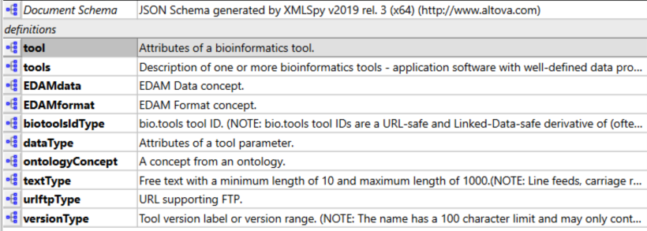

# biotoolsSchemaJSON
**IMPORTANT - work in progress - do not code to this schema!**

Here you'll find biotoolsSchemaJSON - a JSON schema version of biotoolsSchema:
* "Organisational" biotoolsSchema elements (whose purpose is only to structure the schema) are discarded: ```summary```, ```labels```
* All other biotoolsSchema elements are preserved as JSON properties
* biotoolsSchema element structure / nesting is preserved (whilst discarding XSD design patterns not applicable in JSON schema)
* biotoolsSchema element names are preserved as JSON property names 
* biotoolsSschema comments are preserved in JSON ```description:``` properties.  A convention is used where the first sentence is the attribute description, and everything following ```(NOTE:``` is an extended comment.


To make bitoolsSchemaJSON easy to understand and maintain, it uses JSON schema [definitions and references](https://cswr.github.io/JsonSchema/spec/definitions_references/) for objects, and properties with regex patterns, which are re-used in the schema:  
<p align="center">

</p>

* **tools** is the top-level property
* **tool**
* **EDAMdata**
* **EDAMformat**
* **biotoolsIdType**
* **dataType**
* **ontologyConcept**
* **textType**
* **urlftpType**
* **versionType**


Many of the XSD object definitions (```complexType``` and ```simpleType```) are not 


# Files

File                            | Description
----                            | -----------
biotools.json                   | biotoolsSchemaJSON (JSON schema)
stable                          | **ToDo** (Current stable version of the schema + docs)
docs                            | **ToDo**  Technical docs formatted for website (latest stable version).  Hosted [here](http://bio-tools.github.io/biotoolsSchema/) (uses files copied from "stable" folder)
versions                        | **ToDo** Older stable versions of the schema + docs
LICENSE                         | **ToDo** biotoolsSchema license information
README.md		        | This file
