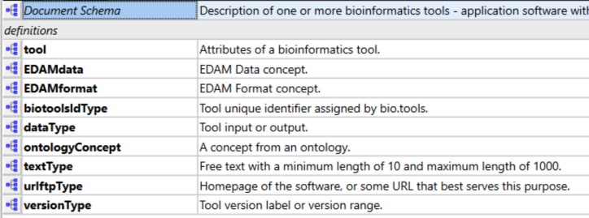

# biotoolsSchemaJ
Here you'll find *biotoolsSchemaJ* - a JSON schema version of [biotoolsSchema](https://github.com/bio-tools/biotoolsschema) - a data model for describing computational tools in life sciences.

Production
----------
biotoolsSchemaJ mirrors biotoolsSchema as closely as possible where possible and desirable:
* biotoolsSchema elements [1] are preserved as JSON properties
* biotoolsSchema element structure / nesting is preserved (whilst discarding XSD design patterns not applicable in JSON schema)
* biotoolsSchema element names are preserved as JSON property names 
* biotoolsSchema comments are preserved in JSON ```title```, ```description``` and ```$comment``` properties.

[1] In biotoolsSchema 3.3.0 "organisational" elements (whose purpose was only to structure the schema) were discarded: ```summary```, ```labels```

Structure
---------
To make bitoolsSchemaJ easy to understand and maintain, it uses JSON schema [definitions and references](https://cswr.github.io/JsonSchema/spec/definitions_references/) for objects, and properties with regex patterns, which are re-used in the schema:  
<p align="center">

</p>

Of these, **tool** is the top-level object. **dataType** and **ontologyConcept** are defined but not actually used (they're retained for now in case they find future use).  All the others are definitions that are refered to in multiple places within the schema.


# Files

File                            | Description
----                            | -----------
biotoolsj.json                  | biotoolsSchemaJ (JSON schema)
docs                            | Technical docs formatted for website (latest stable version).  Hosted [here](http://bio-tools.github.io/biotoolsSchemaJ) (uses files copied from "stable" folder)
docs/example.json		| Example tool description in JSON format
LICENSE                         | biotoolsSchemaj license information
assets                          | Folder for images and other assets
assets/biotoolsSchema_json.xsd  | Ignore (biotoolsSchema 3.2.0 (XSD schema) produced for initial reverse-engineering of the JSON schema)
stable                          | (not used yet) - current stable version of the schema + docs)
versions                        | (not used yet) - older stable versions of the schema + docs
README.md		        | This file
